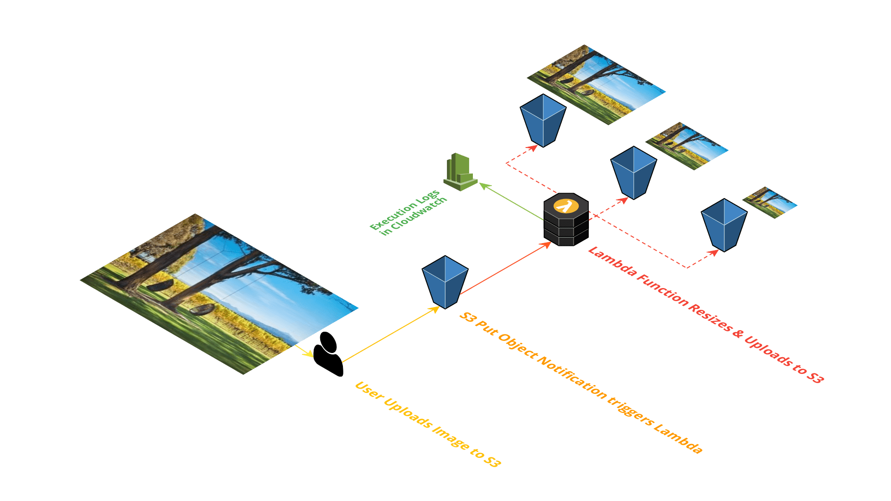

# Serverless Thumbnail Creator

Lets say, we have to create thumbnails, profile picture for the images uploaded by users. We can use S3 Event notification along with lambda function to do it.



#### Follow this article in [Youtube](https://youtube.com/c/valaxytechnologies)

0. ### Prerequisites

- AWS CLI pre-configured

1. ## Clone the repository

   ```sh
   git clone https://github.com/miztiik/serverless-thumbnails-creator.git
   ```

1. ## Customize the deployment

    In the `serverless-thumbnails-creator` directory, Edit the `./helper_scripts/deploy.sh` to update your environment variables.

    **You will have to create an S3 bucket in your account and update the `BUCKET_NAME` in the below section**
  
    ```sh
    AWS_PROFILE="default"
    AWS_REGION="us-east-1"
    BUCKET_NAME="sam-templates-011" # bucket must exist in the SAME region the deployment is taking place
    SERVICE_NAME="serverless-thumbnails-creator"
    TEMPLATE_NAME="${SERVICE_NAME}.yaml"
    STACK_NAME="${SERVICE_NAME}"
    OUTPUT_DIR="./outputs/"
    PACKAGED_OUTPUT_TEMPLATE="${OUTPUT_DIR}${STACK_NAME}-packaged-template.yaml"
    ```

    Save the file.

1. ## Deployment

    We will use the `deploy.sh` in the `helper_scripts` directory to deploy our [AWS SAM](https://github.com/awslabs/serverless-application-model) template

    ```sh
    chmod +x ./helper_scripts/deploy*.sh
    ./helper_scripts/deploy.sh
    ```
  
1. ## Test Event Processor

    Upload an object to the `Source S3 Bucket` created by the stack. You will be able to see the output in the `Destination S3 Bucket` three directories with resized images. In the lambda logs you will see the following output

    ```json
    {
      "status": "True",
      "TotalItems": {
        "Received": 1,
        "Processed": 1
      },
      "Items": [
        {
          "time": "2019-05-09T18:02:24.534Z",
          "object_owner": "AWS:AIDAUR7KWXJQLWZZ56LRA",
          "bucket_name": "serverless-thumbnails-creator-srceventbucket-zwpgvaxxb3qh",
          "key": "wt-cloudtrail-100.png"
        }
      ]
    }
    ```

### Contact Us

You can reach out to us to get more details through [here](https://youtube.com/c/valaxytechnologies/about).