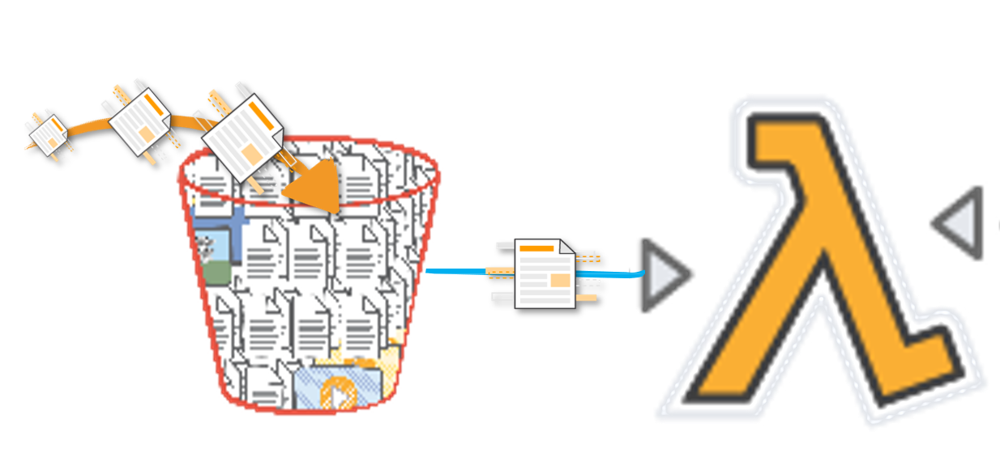

# AWS S3 Real Time Event Processor

Lets say, we have to do some action for every object uploaded / added to S3 Bucket. We can use _DynamoDB Streams_ along with Lambda to achieve the same.



#### Follow this article in [Youtube](https://youtube.com/c/valaxytechnologies)

0. ### Prerequisites

- AWS CLI pre-configured

1. ## Clone the repository

   ```sh
   git clone https://github.com/miztiik/serverless-s3-event-processor.git
   ```

1. ## Customize the deployment

    Edit the `./helper_scripts/deploy.sh` to update your environment variables. The expected output in cloudwatch logs should look like this,
  
    ```sh
    AWS_PROFILE="default"
    BUCKET_NAME="sam-templates-011" # bucket must exist in the SAME region the deployment is taking place
    SERVICE_NAME="serverless-s3-event-processor"
    TEMPLATE_NAME="${SERVICE_NAME}.yaml"
    STACK_NAME="${SERVICE_NAME}"
    OUTPUT_DIR="./outputs/"
    PACKAGED_OUTPUT_TEMPLATE="${OUTPUT_DIR}${STACK_NAME}-packaged-template.yaml"
    ```

1. ## Deployment

    We will use the `deploy.sh` in the `helper_scripts` directory to deploy our [AWS SAM](https://github.com/awslabs/serverless-application-model) template

    ```sh
    chmod +x ./helper_scripts/deploy.sh
    ./helper_scripts/deploy.sh
    ```
  
1. ## Test Event Processor

    Upload an object to the S3 Bucket or use the `event.json` in the `src` directory to test the lambda function. In the lambda logs you will see the following output,

    ```json
    {
      "status": "True",
      "TotalItems": {
        "Received": 1,
        "Processed": 1
      },
      "Items": [
        {
          "time": "2019-05-08T18:51:00.097Z",
          "object_owner": "AWS:AIDdR7KsQLWs56LRA",
          "bucket_name": "serverless-s3-event-processor-eventbucket-novet8m933s4",
          "key": "c19cf74b-ca14-4458-b2f1-c97b51789f67.xls"
        }
      ]
    }
    ```

### Contact Us

You can reach out to us to get more details through [here](https://youtube.com/c/valaxytechnologies/about).